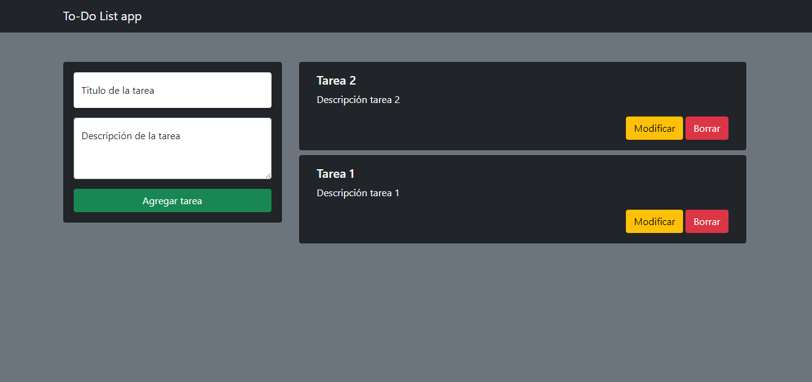
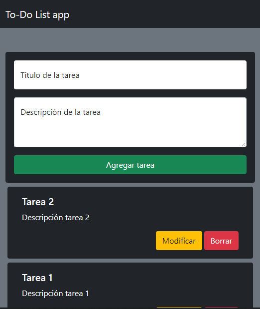

# To-Do List app✔️

## Introduccion

- En este proyecto encontraremos un programa el cual nos permite agregar, modificar y eliminar tareas.
- Este programa hace uso del localStorage perteneciente al navegador, es decir que los datos que ingresemos a este programa, no se eliminaran al cerrar la pagina.

## Screenshots

### Desktop

### Mobile

## Prueba

[Click aqui](https://mdeleonbalbiani.github.io/To-Do-list-app/) para probar